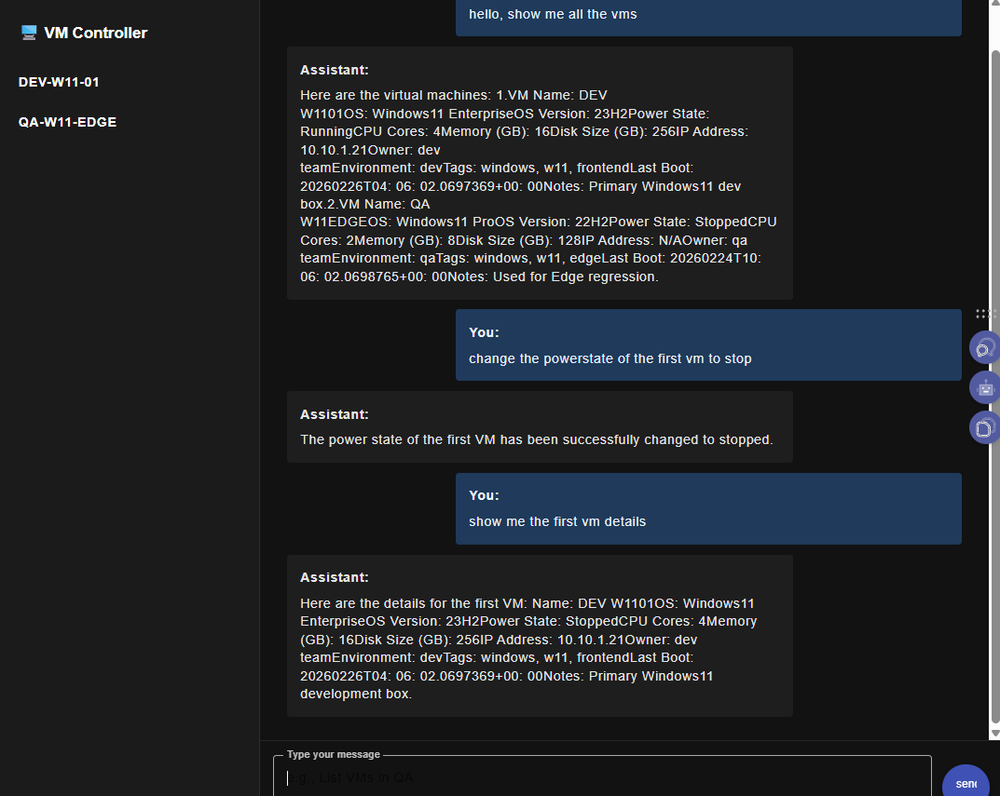

# ChatVMChecker: AI-Powered Virtual Machine Management

A Full-Stack Enterprise Proof of Concept (PoC) demonstrating **Agentic AI Architecture** for IT infrastructure management. 

Instead of a standard conversational chatbot, this project uses **Microsoft Semantic Kernel** and **Azure OpenAI** to act as an orchestrator. It allows users to query, manage, and check the status of Virtual Machines (VMs) using natural language, with real-time UI updates powered by **RxJS** and **Server-Sent Events (SSE)**.

---

## 📸 Demo & Screenshots

### Real-Time AI Streaming (RxJS & SSE)
Watch the AI process requests and stream the response chunk-by-chunk, creating a real-time typing effect:


### User Interface (Angular Material)


---

## 🚀 Tech Stack

### Frontend
* **Angular (17+)**: Modern standalone components and control flow (`@if`, `@for`).
* **RxJS**: Utilized `Observables`, `Subjects`, and `Subscriptions` to handle real-time streaming data.
* **Angular Material**: For a clean, enterprise-grade UI (`<mat-sidenav>`, `<mat-card>`).
* **Fetch API / TextDecoder**: Used for handling Server-Sent Events (SSE) stream processing directly in the browser.

### Backend
* **C# / .NET 8**: High-performance backend routing and logic.
* **ASP.NET Core Web API**: Implementing both standard controllers and Minimal APIs.
* **IAsyncEnumerable**: Used to stream the AI output chunk-by-chunk back to the client (`await foreach`).

### AI & Cloud
* **Microsoft Semantic Kernel**: The orchestrator bridging the .NET backend with AI.
* **Azure OpenAI Service**: Utilizing `gpt-4o-mini` for fast, intelligent reasoning.
* **AI Function Calling (Tool Calling)**: Configured with `FunctionChoiceBehavior.Auto()`, allowing the LLM to autonomously trigger C# `[KernelFunction]` methods to retrieve and manipulate VM data.

---

## 🧠 How It Works (Architecture)

1. **User Request:** The user types a command in the Angular frontend (e.g., *"Show me the status of the QA servers"*).
2. **Backend Orchestration:** The .NET API receives the request and passes it to the Semantic Kernel.
3. **Autonomous Tool Calling:** The AI recognizes it needs server data, autonomously calls the C# `GetLightsAsync` or VM-equivalent plugin, and retrieves the internal backend state.
4. **Real-Time Streaming:** As the AI formats the response, the .NET backend immediately pushes the text back to Angular using `Response.WriteAsync("data: ...")` (Server-Sent Events).
5. **Reactive UI:** Angular catches the chunks using RxJS, applies Regex formatting to clean up Markdown tags, and displays the text in real-time.

---

## 🛠️ Getting Started

### Prerequisites
* **.NET 8.0 SDK**
* **Node.js & Angular CLI**
* An active **Azure OpenAI** resource with a deployed model.

### Quick Setup

1. **Clone the repository:**
   ```bash
   git clon [https://github.com/marius2347/ChatVMChecker-using-Azure-OpenAI-.NET-Angular-RxJs-in-CSharp.git
   
2. **Configure the Backend:**
* Open the `.NET` project and locate the Azure OpenAI configuration variables in `Program.cs` or `appsettings.json`.
* Insert your `Endpoint`, `ApiKey`, and `ModelId`.
* Run the API (defaults to `http://localhost:5000`).

3. **Run the Frontend:**
* Navigate to the Angular project folder.
* Run `npm install` to install dependencies.
* Run `ng serve` and open `http://localhost:4200` in your browser.

---

## 📬 Contact

For any inquiries, feedback, or collaboration opportunities regarding this project or enterprise AI architecture, please reach out:

**Email:** mariusc0023@gmail.com
